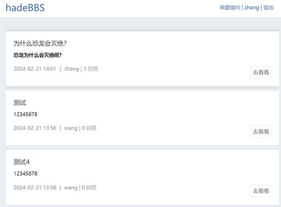

# 基于Hade Web框架的 问答网站

* 前端： Vue3 + Element Plus + TOAST UI Editor
* 后端： Hade + Mysql + Redis

# 运行

* 安装 go 1.18 以上版本 node 20 以上版本

* 安装 mysql (docker) 库配置(./config/development/database.yaml)
    * docker run --env=TZ=Asia/Shanghai --env=MYSQL_ROOT_PASSWORD=root --env=useSSL=false -p 3306:3306 -p 33060:33060 -d mysql:latest

* 安装 redis (docker)
    * docker run -p 6379:6379 -d redis:latest

* 安装前端依赖： npm install
* 编译后端： go build -o bbs.exe

* 初始化表（需要先建好数据库) 
    * ./bbs.exe migrate
  
* 运行：
    * ./bbs.exe dev all
    * 访问：http://127.0.0.1:8070

## 其他

* 注册邮件需要STMP服务，修改 config/development/app.yaml 下的 stmp 配置
* [hade文档](http://hade.funaio.cn/)

# 演示

* 首页
    * 

* 详情
    * 

* 问题编辑
    * 
    
  